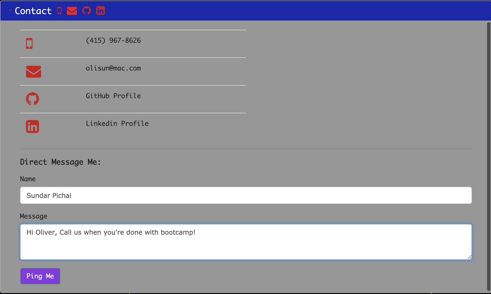
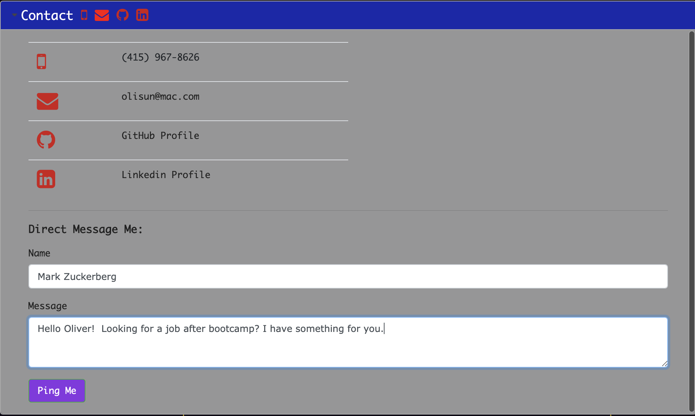
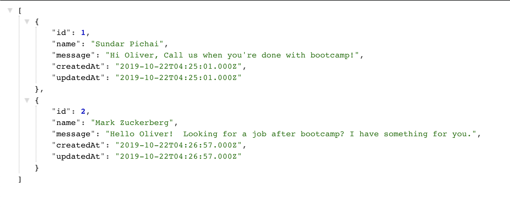
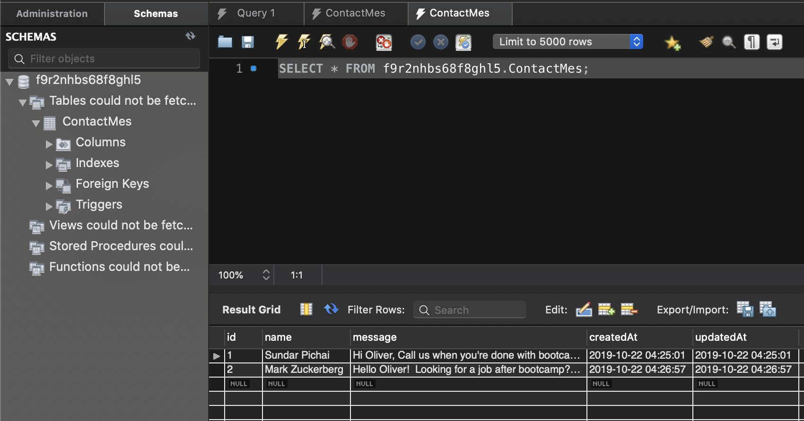
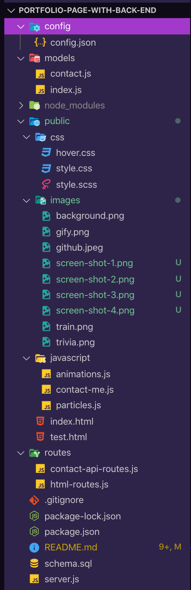

# Portfolio-Page-with-Back-End
Node, Express Servers, MySQL & Sequelize

## Main New Feature Screen-Shots:





## Link to full app demo on Heroku:
https://olis-portfolio.herokuapp.com/

## About the project:

We had to add a back-end to our portfolio, meaning creating a server and routes to the main page(s).

## User Guide:

1. The content is held in a jQuery accordian file with three sections (About Me, Portfolio, Contact).
  
2. In the contact section, there is a new feature where a user can send me a direct message. The message basically get's stored in the MySQL database.

## MVP Objectives:

 * Add a back-end to the portfolio with a server and routes serving up the page(s).

## Stretch Goals:

* Add a database and routes for the database.
* Continue experimenting with newly discovered animation libraries.

  
## Techology Stack:
  * Front-end: HTML, CSS, BootStrap, jQuery, jQueryUI, Javascript (client-side), animate.CSS, Typed.js
  * Back-end: Node.js, Javascript (server-side), Express, Body-Parser, Path, MySQL, Sequelize, Heroku, Nodemon


## Methodology:

My main focus was getting the back-end up and running. I also wanted to add a database so I used Sequelize; added a model with routes and created a simple form in the Contact section. Sequelize captures the sender and the message and it's viewable on MySQLWB. I just wanted to test the capability so that for real future use, I can put all my projects on MySQL and dynamically generate those.

I noodled around with some animation effects from annimate.CSS which I used on my recent team project. I'm holding off on doing a re-design for the reason that React is right around the corner.

## Problems That I Overcame:

I had some initial bugs with the DB capturing the data sent from the form. I overcame this with the help of our TA's and refactored the form submit functions in the client-side js file. Code snippet below.

## Problems Still Facing:

I wanted to add another animation library to the background (particles.js). I also used particles in my recent team project, however, this time code blew-out the currrent CSS styling. Not sure why and with React just right around the corner, I decided to table this for now.

## Code Snippets:
Capturing the form input in the Contact section.
```
  $(document).on("click", "#createContact", function(event) {
    event.preventDefault();
    console.log('on-click running')
    createContact();
  })

  getContacts();

  function createContact() {
    // event.preventDefault();
    console.log("createContact() running")
    if (!newNameInput.val().trim() || !newMessageInput.val().trim()) {
      return;
    }
    newContact({
      name: newNameInput.val().trim(),
      message: newMessageInput.val().trim()
    });
  }
```

## File Structure Screen-Shot



## Link to my Portfolio Page on Github where this app is listed in the portfolio section.

https://github.com/Olisun/Portfolio-Page-with-Back-End

## You can also reach me on LinkedIn.
https://www.linkedin.com/in/oliver-sun-4b6baba/

